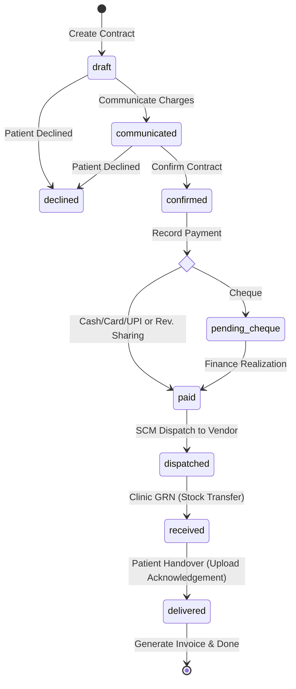
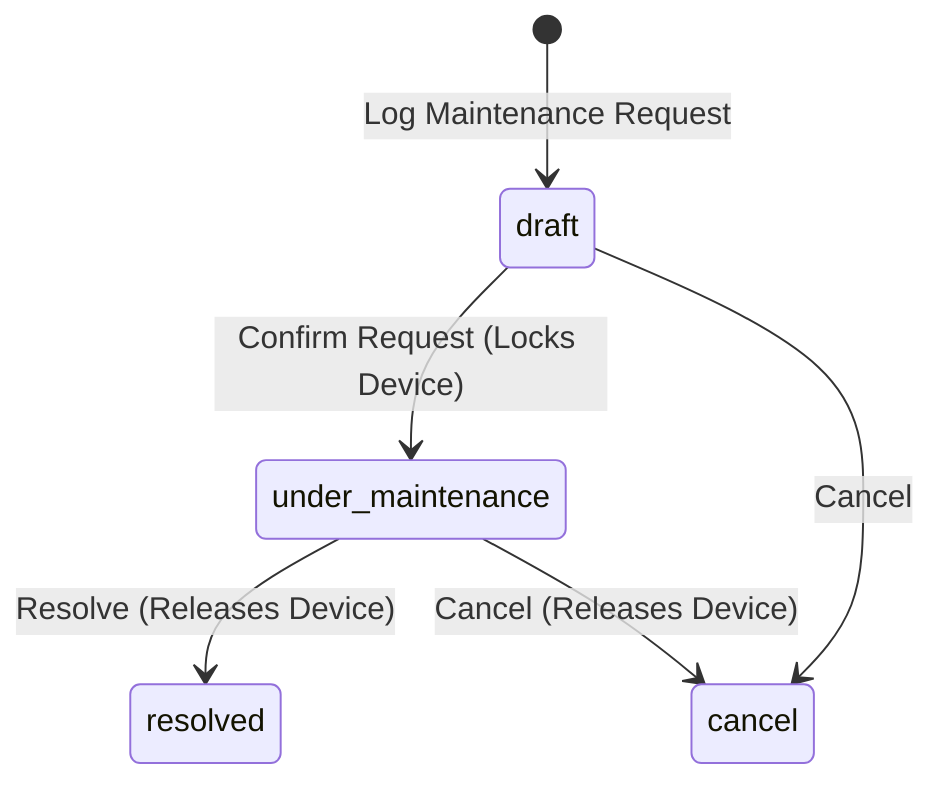

# Accessories Warranty, Maintenance & Repair Management Flow Guide

This document describes the end-to-end operational flow of the **Repair Service Contract** and **Clinic Device Maintenance** modules in Odoo.

---

## 1. Smart Data Auto-Population & Client Serial Number Filtering

When creating a new Repair Contract, selecting a **Patient** triggers an automated data retrieval and security filter:
1. **Home Clinic**: The repair contract's clinic automatically defaults to the patient's registered Home Clinic.
2. **Client-Specific Serial Filtering**: Serial number dropdowns (`left_lot_id`, `right_lot_id`) are strictly domain-filtered to show only lots fitted to or purchased by that specific client (via delivered Stock Moves / POS or Appointment Device Sales).
3. **Hearing Aid & Vendor Auto-Population**: Selecting or auto-fetching a Serial Number immediately populates the Product Model, Device Code, Manufacturer, and automatically sets the primary **Repair Lab / Vendor**.
4. **Ear-Specific Repair Notes**: Symptoms and notes can be logged independently for Left Ear (`left_repair_notes`) and Right Ear (`right_repair_notes`).

---

## 2. Accessories & Hearing Aid Warranty Validation Flow

Warranty verification in Odoo happens automatically per ear (Left & Right) using multi-tier validation:

### Level A: Serialized Devices (Hearing Aids or Serialized Accessories)
- **Action**: When creating a Repair Contract, select the **Serial Number** (`left_lot_id` / `right_lot_id`).
- **Logic**:
  1. If `warranty_end_date` is explicitly defined on the Lot Master, it is used directly.
  2. If not defined on the Lot, the system searches for the **Fitting Closure Date** (completed Fitting Appointment `resonnocare.appointment` for that patient).
  3. Warranty end date is calculated as: `Fitting Closure Date + product.warranty_months`.
  4. If today's date falls on or before this date, `left_is_under_warranty` / `right_is_under_warranty` is marked **True**.

### Level B: Non-Serialized Accessories (Batteries, Chargers, Tubes, etc.)
- **Action**: Select the **Product Model** directly without entering a Serial Number.
- **Logic**: 
  1. The system queries Odoo's posted customer invoices (`account.move`) to check if this patient has previously purchased this exact accessory.
  2. If a purchase invoice is found, it retrieves the `invoice_date`.
  3. It fetches the product's warranty duration in months (`warranty_months`) from the Product Master.
  4. The warranty end date is calculated as: `invoice_date + product.warranty_months`.
  5. If today's date falls within this calculated window, `is_under_warranty` is marked **True**.

---

## 3. Repair Contract Lifecycle & States

A Repair Contract (`resonnocare.repair.contract`) transitions through the following states:

### Key Workflow Operations:

1. **Draft**: Create the contract, input patient, clinic, device models, and check symptoms.
2. **Charges Communicated**: Audiologist enters handling charges and estimated repair charges, then communicates them to the patient.
3. **Confirmed**: If the patient accepts, clicking **Confirm Contract** locks basic details and generates the repair contract serial number (`REP/YYYY/XXXXX`).
4. **Paid**:
   - **Corporate Mode**: Input payment method. Cash, UPI, or Card payments immediately mark the contract as paid. Cheque payments enter **Pending Finance Approval**; the Finance team must click **Finance Approve Cheque** once realized in the bank.
   - **Revenue Sharing Mode**: The Audiologist enters the partner hospital receipt number and uploads the hospital payment receipt file.
5. **Dispatched to Lab**: SCM team updates dispatch tracking and sends the unit to the repair lab.
6. **Received at Clinic**: Once repaired, the SCM team logs the vendor invoice details. Clicking **Receive at Clinic** automatically creates and validates an incoming Odoo `stock.picking` (GRN) to move the serialized unit back to the clinic's local stock.
7. **Delivered**: Handover to patient. Requires the Audiologist to upload a signed patient acknowledgement scan. Clicking **Deliver to Patient**:
   - Generates and posts a Patient Invoice (Corporate mode).
   - Generates and posts a B2B Sharing Invoice to the Partner Hospital (Revenue Sharing mode).

---

## 4. Clinic Internal Device Maintenance Flow

This workflow manages internal clinic diagnostic machines (Audiometers, computers, etc.) to ensure that broken devices are not assigned or scheduled.

### Operational Steps:
1. **Log Request**: Create a log in `Clinic Device Maintenance`. Select the device (`resonnocare.device`) and write down the issue description.
2. **Lock Device**: Click **Confirm / Lock Device**. 
   - The maintenance state transitions to `under_maintenance`.
   - The linked device status in the inventory database is automatically updated to **"Under Maintenance"** (preventing its selection in diagnostic usage scheduling).
3. **Rectify & Resolve**: Once repaired by the technician:
   - Audiologist/Admin logs the `action_taken`.
   - Click **Mark Resolved / Release Device**.
   - The log state transitions to `resolved`.
   - The device status is restored to **"Available"**.

---

## 5. Roles & Access Matrix

| Role | Repair Contracts | Device Maintenance | Key Actions |
|---|---|---|---|
| **Audiologist** | Read / Write / Create | Read / Write / Create | Confirm contract, record payment, attach signature, log device issue |
| **Finance Team** | Read / Write | Read | Approve Cheque payment realization |
| **SCM Team** | Read / Write | Read | Dispatch to lab, record vendor invoices, process incoming GRNs |
| **Clinic Admin** | Read / Write | Read / Write / Create | Manage internal device maintenance requests |
| **Super Admin** | Full Access | Full Access | Override configurations and full access to both modules |
